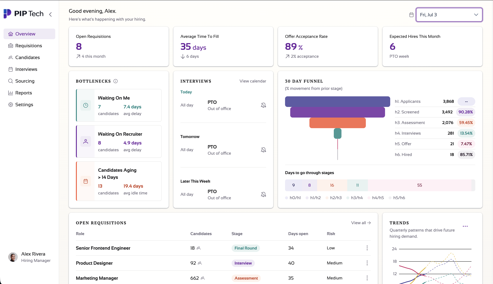

# PIP Tech Dashboard

Work in progress: Hiring-manager dashboard. Built in Angular, with Typescript and Tailwind and using PrimeNG components. Mocked with dummy data.

**Live demo:** [pipeline-dashboard-seven-chi.vercel.app/](https://pipeline-dashboard-seven-chi.vercel.app/)



## Stack

- **Angular** 21.2.x
- **PrimeNG** 21.x
- **Tailwind CSS** 4 + `tailwindcss-primeui`
- **Node** 20.19+, 22.12+, or 24+ (26.2.x used in development)
- **npm** 8+ (`package-lock.json` — use npm, not yarn/pnpm)

Check `node -v` and `npm -v` against the ranges above before installing.

## Setup

**1. Clone the repo**

```bash
git clone https://github.com/SneauxGirl/pipeline-dashboard.git
cd pipeline-dashboard
```

**2. Install dependencies**

```bash
npm install
```

**3. Start the dev server**

```bash
npm start
```

**4. Open the app**

[http://localhost:4200](http://localhost:4200)

The dev server reloads when you change source files.

### Production build (optional)

```bash
npm run build
npm run serve:ssr:pip
```

Output goes to `dist/pip/`. Fonts load from Google Fonts on first visit (network required for typography).

Section components live under `src/app/sections/` and compose on `src/app/pages/dashboard/`. Data is 
static from `src/app/data/`. Design tokens in `src/app/theme/pip-tokens.ts`; global styles in `src/styles.css`

### Mock Data

Currently mid-refactor from weekly to daily.

## Scripts

| Command                 | Purpose                          |
| ----------------------- | -------------------------------- |
| `npm start`             | Dev server (`ng serve`)          |
| `npm test`              | Unit tests (Vitest)              |
| `npm run build`         | Production build                 |
| `npm run serve:ssr:pip` | Run SSR server after build       |

## Contact

For design questions or feedback, open an issue on this repository or contact Heather Hugo on [GitHub](https://github.com/SneauxGirl).

